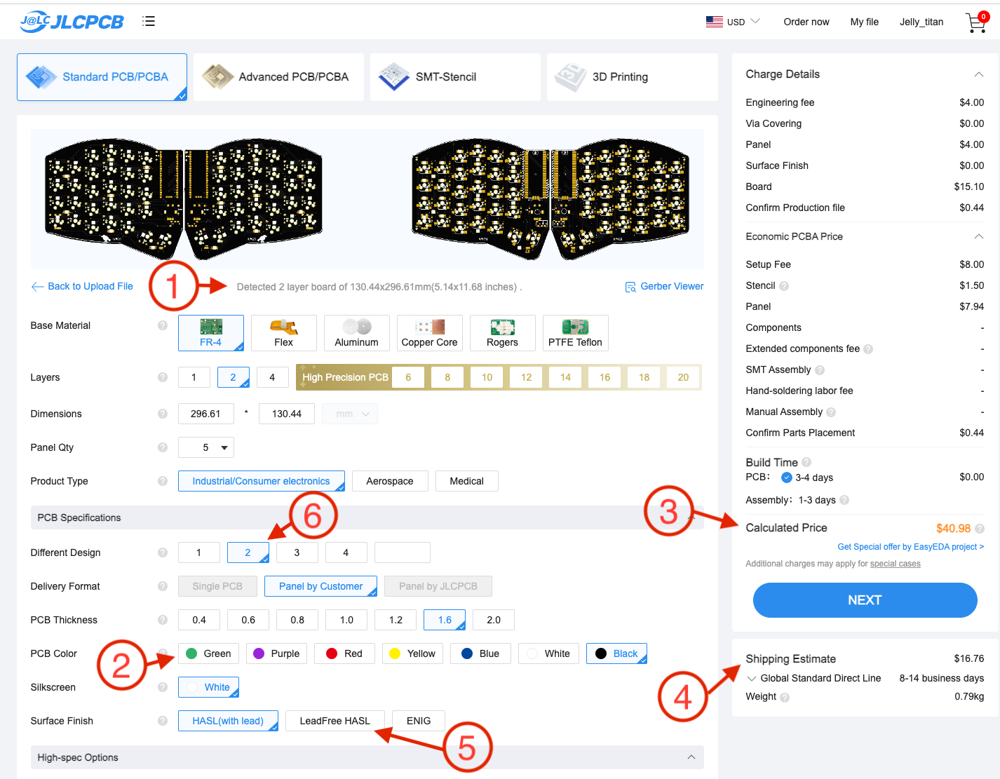
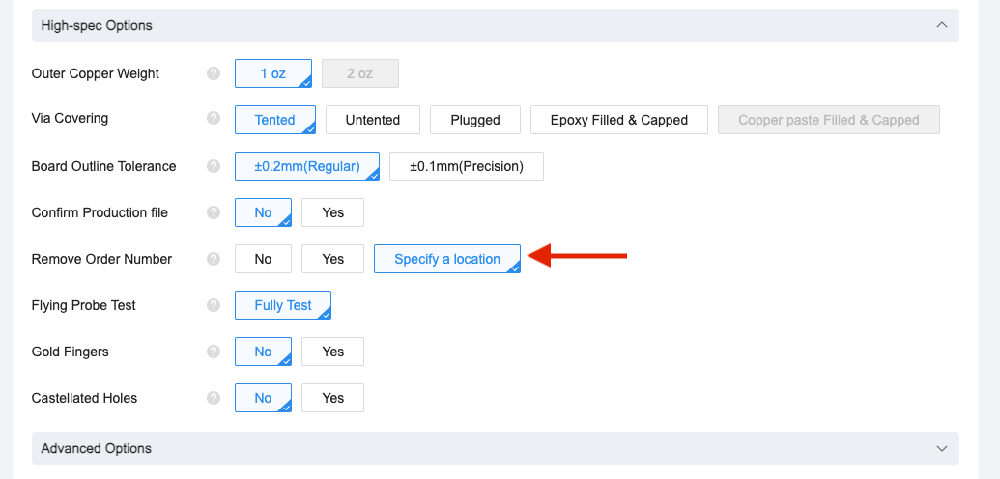
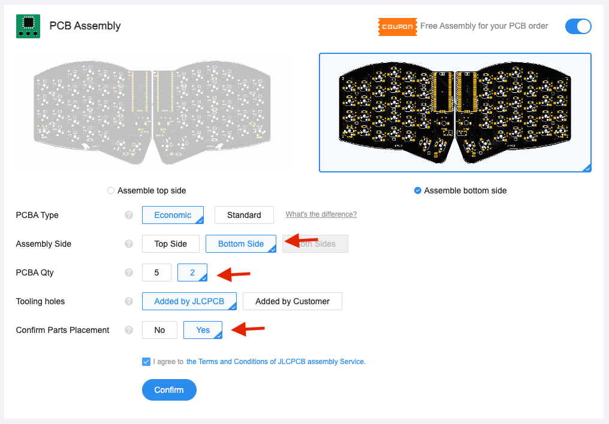
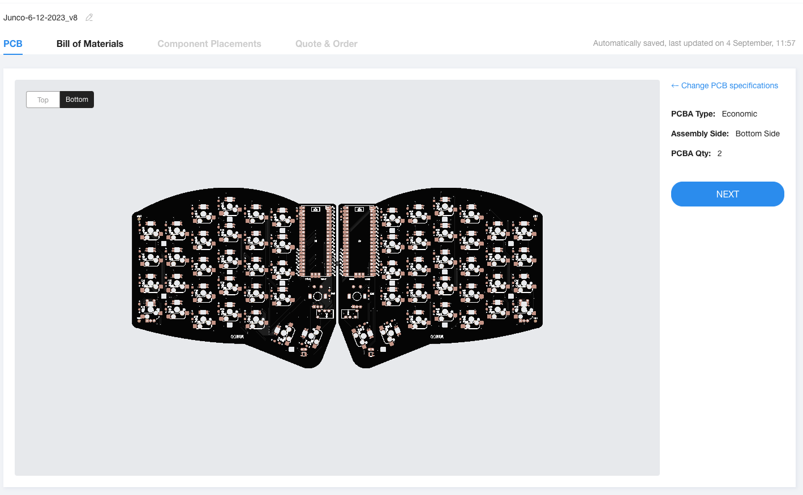
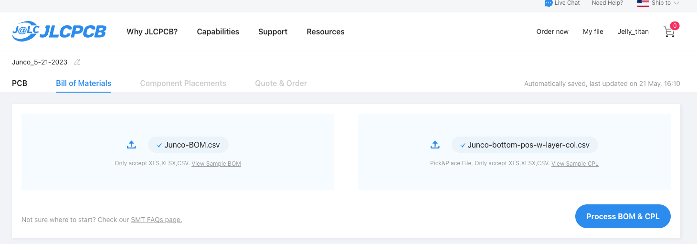
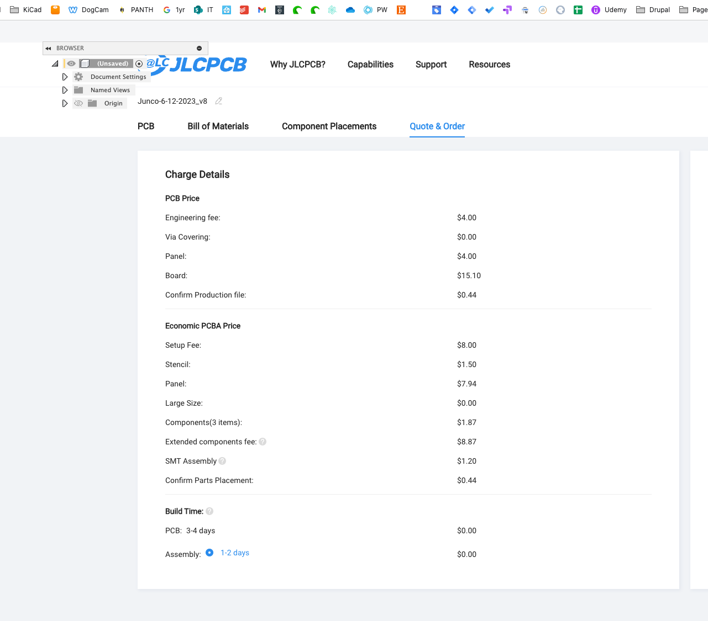

# PCB Ordering Guide.
How to order this board from a PCB vendor - helpful info if it's your first time ordering a PCB, or if it's your first time using a PCB assembly service.

Most PCB vendors have a similar ordering process. I use [JLCPCB](https://jlcpcb.com/) because they are usually the most cost effective. I've had good luck with [Elecrow](https://www.elecrow.com/) too. [You can find PCB price comparison tools online.](https://pcbshopper.com/) When comparing pricing, the board dimensions for the Junco are 131mm x 297mm. (Usually anything under 100x100mm is really cheap - so be sure to use the 131x297 dimensions when pricing). PCB assembly is usually an extra fee, as well as the cost of components.

This guide covers ordering from JLCPCB using their PCB assembly service. Select components have been excluded from automated assembly to keep costs down.

## JLCPCB assembly service _is_ used for:
* Diodes. These cost about one cent USD each, so 5 boards sets with 315 diodes and 630 solder joints costs ~$3.55 USD.
* Level-shifter. There is no through hole variant available, and the smd can be difficult to hand solder.
* Per-key LEDs. These cost about the same to hand solder - but with 4 solder points per LED, thats' 232 joints per set, or 1160 solder joint per batch of 5 boards.
## Components JLCPCB assembly is _not_ used for:
* Pi Pico. These are not stocked at JLC. To be used in PCB assembly, you would need to have them shipped to and stored at JLC.
* Underglow LEDs. JLC charges for pcb assembly per-side. (Roughly $25 USD). We can't simply move these to the backside, because the orientation of the component in the tape reel determines which side faces up/down. Since these LEDs face the opposite direction of the per-key LED's, they must be installed on the opposite side of the board.
* Hotswop sockets. JLC considers these 'special' components, and charges an additional $25. (It's technically an upgrade from "Economic" to "Standard" assembly).

## Placing the order

Usually the minimum quantity to order is 5 boards. 

The production files are known as "gerbers", and they are usually uploaded as a `.zip` file. (It's essentially a collection of files for each layer of the board, like holes, graphics, traces etc.) 

In this repo, the zipped gerber file for the Junco can be found under [PCB/gerbers](https://github.com/daneski13/Junco/tree/main/PCB/gerbers/).
### Uploading the Gerber
The homepage of JLCPCB has a drag & drop upload. Drag the gerber `.zip` and drop it on the "add gerber file" box.

### Basic options
While the file is uploading, it will take you to an options screen. Once the board size is detected1, the price3 will update accordingly.
Changing the pcb color2 may impact production time and price. If you use the PCB Assembly service, you will only be able to choose green or black, for no additional charge.
Shipping estimates4 can vary widely, so be sure to check those. (You'll see these options again during checkout). It's not uncommon for shipping to exceed the cost of the boards.
The default pcb surface finish contains Lead. For boards in cases, this is usually not a problem. If you're going to rock a naked board, consider going with "lead free"5 for a few bucks more. On the "Different design"6 option, select "2". If you ignore this option, JLC will halt the order and charge you extra for having 2 designs on 1 pcb. 
I usually leave all the other options at the defaults.

### Order numbers
As part of the manufacturaing process, jlc will print an order number on the boards. If you select "specify a location", then jlc will use the location that has been designated in the gerber file, which is above the topmost middle finger. (Most people will never notice the order numbers regardless of the location).

### PCB Assembly basic options
At the bottom of the page, there is a section for PCB assembly. Leave the PCBA Type on "Economic" and Select "Bottom side". You can also select either 2 or 5 PCBs to be assembled. (The rest of the screencaps are for assembly of 2 boards). I highly recommend the "Confirm Parts Placement" option. It costs a bit extra, but your assembly is reviewed by JLC before it goes into production. 

### BOM & PNP Upload
After hitting "Next" on the PCB screen, you'll be taken to the "Bill of Materials" tab. It should show a render of the pcb:

Clicking "Next" Will bring you to the BOM/PNP upload screen. Uplad the files in this folder titled `JUNCO v1.1 BOM JLC.csv` and `JUNCO v1.1 PNP Backside JLC.csv` These files are CSV's indicating the component type and locations.  These files were created by exporting them from KiCad, and then reformatting to meet JLCPCB specifications. These files are only intended for backside components. If you would like to use PCB Assembly services for front side components, you'll need to generate these files yourself.

### Component confirmation
The next screen lets you select/deselect the components for assembly. 

If you select the hotswop sockets, you'll get an option to upgrade your assembly service, if you are willing to pay extra.

Some components may be out of stock, like the SK61803 LED's in the screen caps. I had to order them separately, wait until they came in, and then place this order. (Which is why the cost is showing as 0). If you click "Next" while some parts are unselected, you will get this friendly warning error, which you can ignore if your deselection was intentional.

After clicking "Next" you'll see a render depicting component placement. In my experience, this is always wrong, which is why i recommend the "Confirm Parts Placement" option. (I don't know if this is a JLC bug, or a board origin issue - but if you know - please submit a PR!)

# Final Quote
The next tab is "Quote and order". 
