<h1 align="center">Junco</h1>

[![QMK: Compatibility](https://img.shields.io/badge/QMK-Powered-brightgreen?logo=)](https://github.com/qmk/qmk_firmware)
[![VIA: Compatibility](https://img.shields.io/badge/VIA-Supported-brightgreen?logo=)](https://usevia.app/)

Named after a small North American bird, Junco is a 60% Raspberry Pi Pico powered split keyboard boasting a 4x6 layout with an aggressive columnar stagger, 2-4 rotary encoders, and per-key RGB lighting.

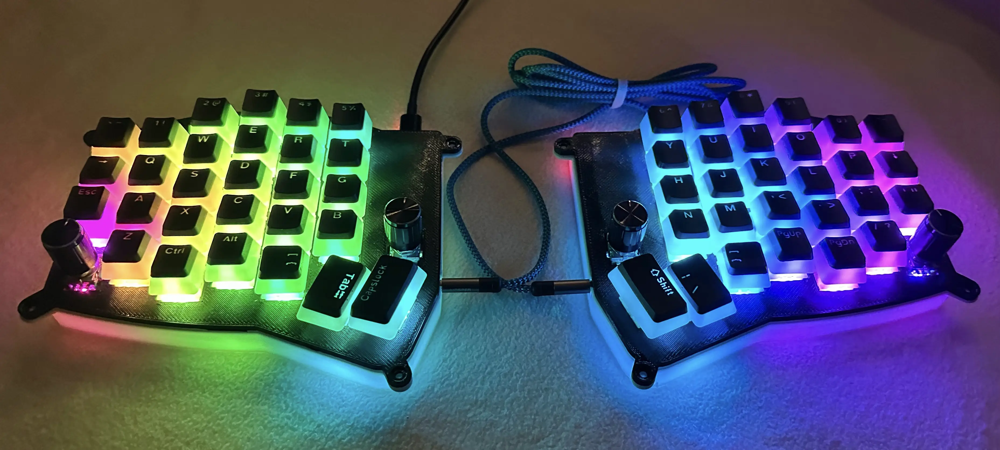

Want to contribute? Check out [Contributing](./CONTRIBUTING.md).

Junco is inspired by the excellent [crkbd](https://github.com/foostan/crkbd), [Iris](https://keeb.io/collections/iris-split-ergonomic-keyboard/products/iris-keyboard-split-ergonomic-keyboard), [Kimiko](https://github.com/Keycapsss/Kimiko), [Sofle](https://github.com/josefadamcik/SofleKeyboard), and [Ferris](https://github.com/pierrechevalier83/ferris) keyboards.

- [Design Philosophy and Quirks](#design-philosophy-and-quirks)
  - [Philosophy](#philosophy)
  - [Quirks](#quirks)
- [Build Guide / Assembly](#build-guide--assembly)
  - [Parts](#parts)
    - [Required](#required)
    - [Optional - RGB](#optional---rgb)
  - [Soldering](#soldering)
    - [Diodes](#diodes)
    - [RGB (Optional)](#rgb-optional)
    - [Pico](#pico)
    - [Hot-swap Sockets](#hot-swap-sockets)
    - [TRRS jack and Rotary Encoders](#trrs-jack-and-rotary-encoders)
  - [Case](#case)
  - [Flashing the firmware](#flashing-the-firmware)
- [Troubleshooting](#troubleshooting)
  - [No LEDs are working](#no-leds-are-working)
  - [Some LEDs are not working](#some-leds-are-not-working)
  - [An entire row or column of keys is not working](#an-entire-row-or-column-of-keys-is-not-working)
  - [Random key or keys not working](#random-key-or-keys-not-working)

## Design Philosophy and Quirks

### Philosophy

In my search for an ergonomic split keyboard, I came across several great keyboards, but I craved a combination of features and ideas from several with my own flavor. Iris' aesthetics, Kimiko's stagger and layout, elements of Ferris' philosophy.

I also wanted to use Raspberry Pi Picos for the controller as it has many advantages over the ProMicro that is normally used in custom keyboards. At the time, Pico powered keyboards were not yet really a thing and weren't yet supported by the main QMK branch. Thus, I created my own keyboard.

The Junco was designed around a set of goals, similar in vain to the Ferris.

**Goals:**

- Low-Cost
- Raspberry Pi Pico / RP2040
  - Superior flash storage and processing power compared to the common ATMega32 ProMicro
  - Faster than STM32 blackpill with more flash storage at the same cost or less
- Comfort
  - Aggressive Columnar Stagger
- Aesthetics
  - Almost all soldering done on the backside of PCB, optional RGB
- 60% layout
  - Near perfect blend of compactness and easy use without crazy combos or layer gymnastics
- Multiple rotary encoder support
- Hot-swap switches
- Plug and play either side of the split
  - Convenience and traveling
  - Flexible cable management
- Minimal different parts and easy to source
  - No need to buy a different types of LEDs or diodes. No reset switches, capacitors, resistors etc. required.

**Non-goals:**

- Reversible PCB
  - Can make assembly confusing and more error prone
- Multi-switch support
  - MX switches should use MX spacing, Choc switches should use Choc spacing.
- OLED Support
  - OLEDs are an added cost and somewhat comprise the aesthetics in my opinion. Don't find useful for a keyboard, more of a novelty.

### Quirks

Being my first venture into keyboard design... Junco unfortunately suffers from a few "quirks" at the moment that may or may not bother you:

- The case files currently provided in this repo assume PCB mounted switches and uses a 3mm switch plate that is flush with the PCB. This presents some problems that a more proper suspended switch plate would not have:
  - Mounting the Pico on the backside with headers causes a bit of the header to be exposed on the front side of the PCB, so the switch plate provided in this repo will not sit flush with the PCB.
  - The TRRS jack is also soldered on the backside, causing another uneven surface for the switch plate.
  - Thus, material must be removed from the back of the switch plate in the proper places for a flush fit.
    - Heat-gunning the switch plate in the proper area, lining it up with the PCB, and squishing provides a quick and *dirty* solution if done correctly.
  - **PRs are welcome to improve upon the case files or to create new cases as I am a 3D design novice.** A proper fix would be to have the PCB rest on the middle section's lip about 1.5mm below the switch plate. This would also allow plate mounted switches to properly latch onto the switch plate.

## Build Guide / Assembly

### Parts

#### Required

Where "56-58" is the count, 58 is needed with 2 rotary encoders. subtract from 58 every additional encoder (4 encoders 56, with 3 encoders 57).

| Name                                 | Count                   | Remarks                                                                                                                                                                                                                                                                                                                                                                                                                                                     | Potential Storefront                                                        |
| ------------------------------------ | ----------------------- | ----------------------------------------------------------------------------------------------------------------------------------------------------------------------------------------------------------------------------------------------------------------------------------------------------------------------------------------------------------------------------------------------------------------------------------------------------------- | --------------------------------------------------------------------------- |
| PCB                                  | 2 (1 left and 1 right)  | PCBs can be ordered from manufacturers such as JLCPCB and LCSC                                                                                                                                                                                                                                                                                                                                                                                                                                                          |                                                                             |
| MX Hot-swap Sockets                  | 56-58                   |                                                                                                                                                                                                                                                                                                                                                                                                                                                             |                                                                             |
| Diodes                           | 62                      |Surface mount SOD-123 1N4148, _or_ through-hole 1N4148 diode. These are both common and inexpensive, any one should do. Through hole is usually easier to solder.                                                                                                                                                                                                                                                                                                                                                                                                                                              | SMD: [AliExpress](https://www.aliexpress.us/item/2251832663565152.html)  [JLCPCB Part#: C2972760](https://jlcpcb.com/partdetail/3368026-1N4148SOD123/C2972760)  Through-hole: [AliExpress](https://www.aliexpress.us/item/2251832473773777.html)           |
| Raspberry Pi Picos                   | 2                       | PCB is specifically designed with the official Pico and YD-2040 type clone in mind, however several [other clone types](https://docs.google.com/spreadsheets/d/1LPjy6F5lHfUkmsrM5zlZmc5auYy5YBakW8Awe6hYFWo) should be compatible (Waveshare, WeAct, EstarDyn, Tenstar). Also, the case is currently designed assuming the Pico is soldered with [headers](https://www.sparkfun.com/products/17907), but surface mounting the Pico is supported on the PCB. | [AliExpress, YD-2040](https://www.aliexpress.us/item/3256803909832318.html) |
| TRRS Jacks                           | 2                       | PJ-320A                                                                                                                                                                                                                                                                                                                                                                                                                                                     | [AliExpress](https://www.aliexpress.us/item/2255800474897706.html)          |
| TRRS Cable (3.5mm "Headphone" Cable) | 1                       | TRRS (4 pole) is currently required, not TRS (3 pole)                                                                                                                                                                                                                                                                                                                                                                                                       |                                                                             |
| MX Style Switches                    | 56-58                   |                                                                                                                                                                                                                                                                                                                                                                                                                                                             |                                                                             |
| Key Caps                             | 56-58                   |                                                                                                                                                                                                                                                                                                                                                                                                                                                             |                                                                             |
| Rotary Encoders and Caps             | 2-4                     | EC-11 Rotary Encoder                                                                                                                                                                                                                                                                                                                                                                                                                                        | [AliExpress](https://www.aliexpress.us/item/2261799870168498.html)          |
| M3 6mm or 6mm+ Screws and Nuts       | 8                       |                                                                                                                                                                                                                                                                                                                                                                                                                                                             |                                                                             |
| Case                                 | 1 Left Set, 1 Right Set | Case files are located in the [case folder](./Case).                                                                                                                                                                                                                                                                                                                                                                                                        |                                                                             |
| Micro USB Cable or USB-C Cable       | 1                       | USB cable for connecting the keyboard to your computer, dependent on what the Pico you chose uses.                                                                                                                                                                                                                                                                                                                                                          |                                                                             |

#### Optional - RGB

These parts are necessary for the RGB lighting.

| Name                                          | Count | Remarks                                                                                                                                                                            | Potential Storefront                                               |
| --------------------------------------------- | ----- | ---------------------------------------------------------------------------------------------------------------------------------------------------------------------------------- | ------------------------------------------------------------------ |
| 74AHCT1G125 Voltage Level Shifter/ Bus Buffer | 2     | SOT23-5 Footprint     Required for LEDs to work properly, Pico runs at 3.3V while the LEDs will require 5V                                                                 | [AliExpress](https://www.aliexpress.us/item/3256803831434811.html)   [JLCPCB Part# C7484](https://jlcpcb.com/partdetail/TexasInstruments-SN74AHCT1G125DBVR/C7484)|
| RGB SMD LEDs (Prefer SK6803MINI-E)            | 74    | The 3MA SK6803MINI-E is highly recommended over the more traditional 12MA SK6812MINI-E due to its smaller current draw, allowing the LEDs to be very bright at manageable wattage. | [AliExpress](https://www.aliexpress.us/item/3256803450292556.html)   [JLCPCB Part# C5184589](https://jlcpcb.com/partdetail/Normand-SK6803MINIE/C5184589)|

### Soldering

The PCB is not reversible, there is a dedicated right and left half in the KiCad PCB files. Almost all of the soldering will occur on the backside of the PCB. 

#### Diodes

Solder the diodes as you see in the photo.
SMD diodes are soldered on the back of the board. 
Through-hole diodes are inserted on the back of the board, and soldered on the front.

**Note** that the diodes have polarity, ensure the line on the diode matches the silkscreen.

# @todo Get a phot of Through-hole diodes

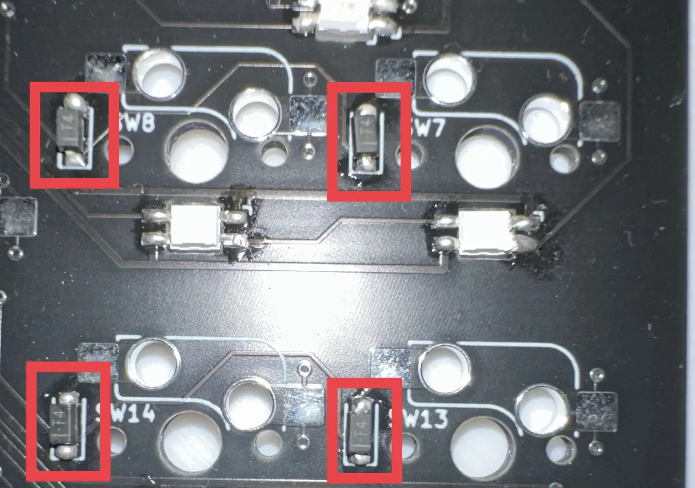

#### RGB (Optional)

All LEDs must be soldered to the PCB for RGB to work properly, even if you will not be using backlight or will be using an encoder that covers an LED. (They are wired in serial).

First solder the level shifter. It's tiny & squirrley - [drag soldering](https://www.youtube.com/watch?v=wUyetZ5RtPs)" is a good method. See photo:

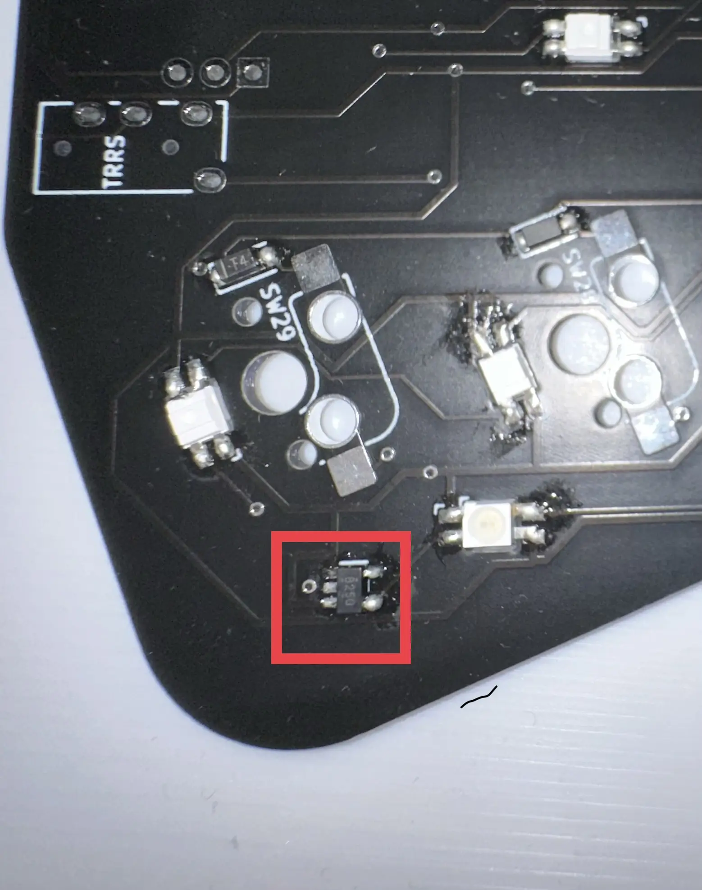

All LEDs will be soldered facing _down from you_. The LEDS for per-key RGB will be soldered on the back of the board, while the LED's for the underglow will be soldered on the front of the board.

**Note** the LED orientation is very important. One of the pads on each LED will be misshapen relative to the others, this pad should connect to the PCB pad that is marked by the L shape on the silkscreen. For a sanity check, a corner of the LED's front-side will also be "cut", this corner must also line up with the L shape on the silkscreen.

# @todo REWRITE this and add update pictures
Blue is LEDs that will face away from you, towards the front-side of the PCB for the per-key lighting. Red will face "up" at you for the underglow:

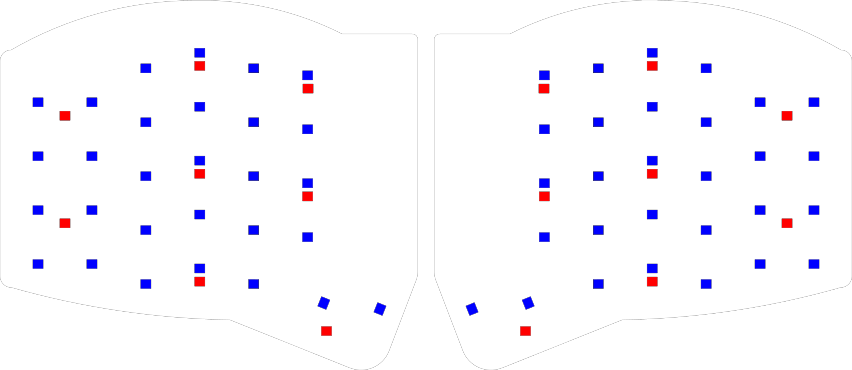

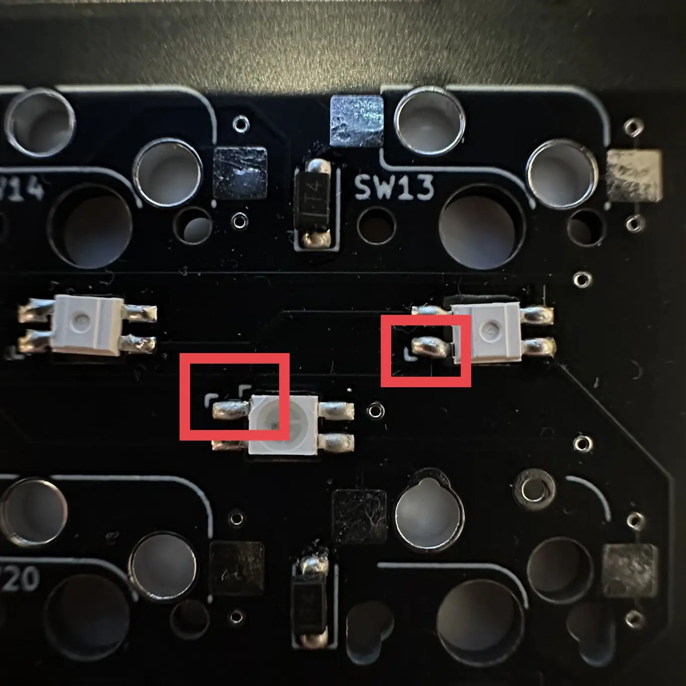

After you finish the next step of soldering the Pico to the PCB, recommend plugging the keyboard in and flashing QMK to ensure the LEDs are lighting up. If there are any issues, check the troubleshooting section.

#### Pico

If you are soldering the Pico surface mount style, go ahead with soldering it to the backside of the PCB and you can skip to the next section.

If you are soldering the Pico using headers, first solder the Pico to the headers and then the header/Pico to the PCB. 

**Ensure that you are soldering the Pico/Header onto the backside of the PCB.**

The best way to go about this method is to rest the shorter end of the headers in the through-holes of the PCB on a flat surface and place the Pico on top, through the longer end of the header. This will stabilize the headers somewhat and ensure proper spacing. Solder the Pico to the 2 header pins on the both the "top" and "bottom" of the Pico to hold it in place. Proceed to solder the Pico to the rest of the header's pins.

After the Pico is soldered to the header, flip the PCB over and solder the sticking-out header pins to the PCB. Start with the 2 "top" and 2 "bottom" header pins to hold it in place, being sure to minimize the space between the header's plastic and the PCB. Proceed to solder the PCB to the rest of the header's pins.

The end result will look like this:

Backside of PCB:

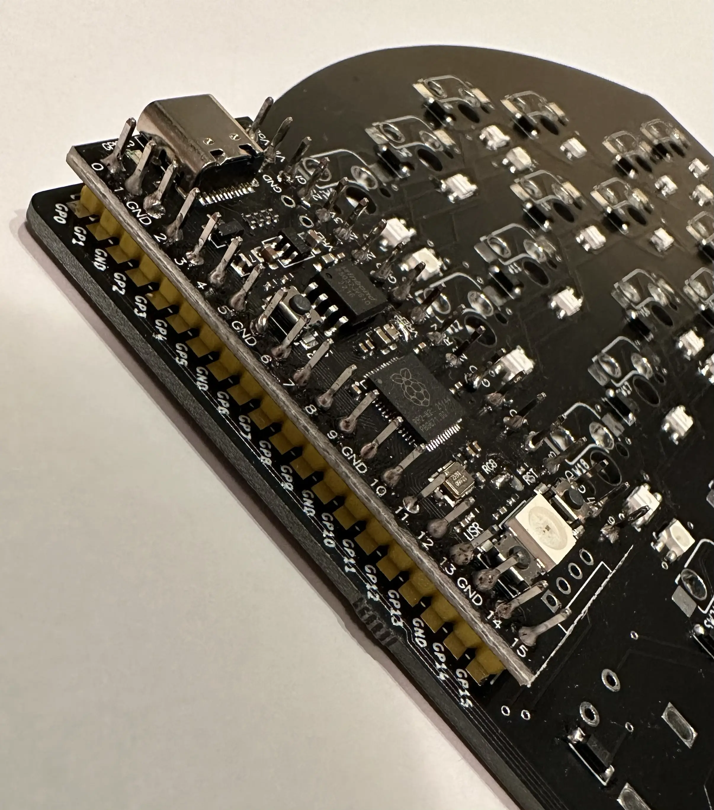

Front-side of PCB:

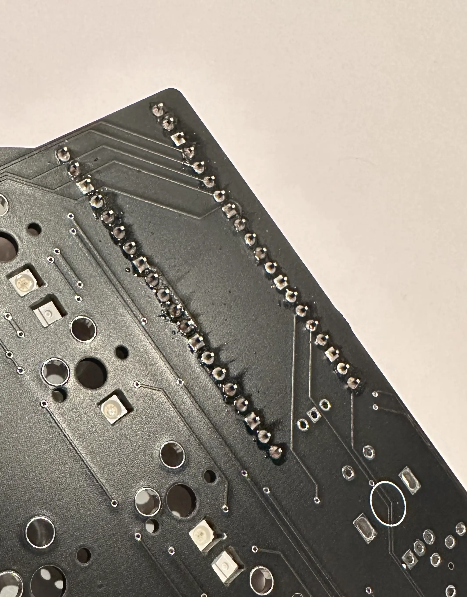

#### Hot-swap Sockets

Place hot-swap sockets on the backside of the PCB and solder. See photo:

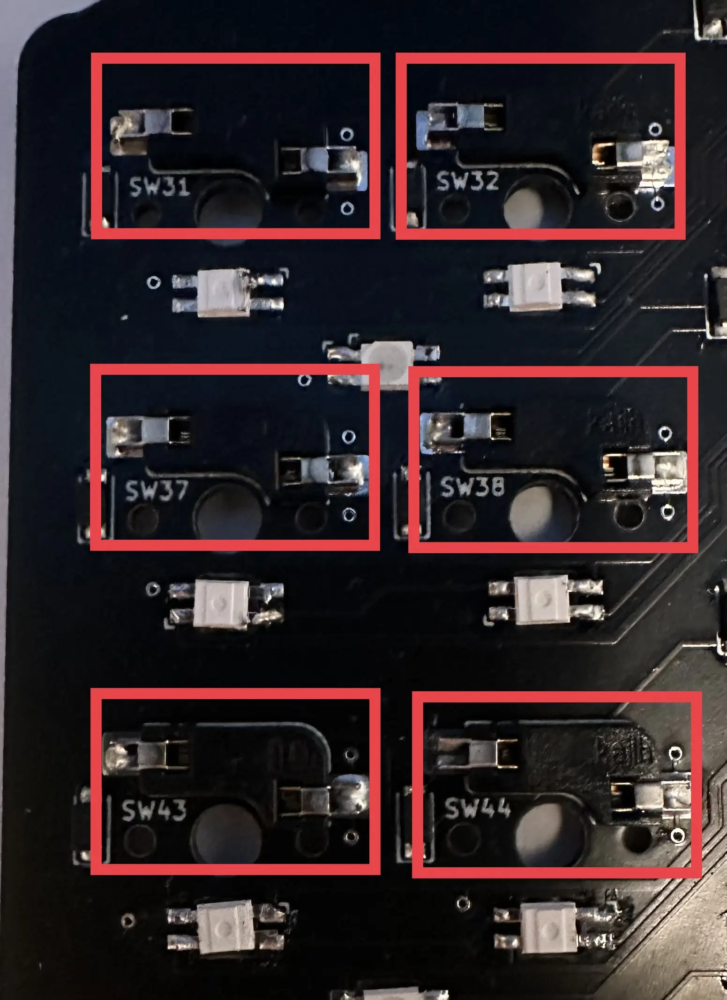

#### TRRS jack and Rotary Encoders

The process for soldering the TRRS jack and the process for the rotary encoders are very similar.

On the **backside** of the PCB, place the TRRS jack. On the front-side of the PCB, bend the pins of the TRRS jack to "latch" onto the PCB and solder.

Backside PCB:

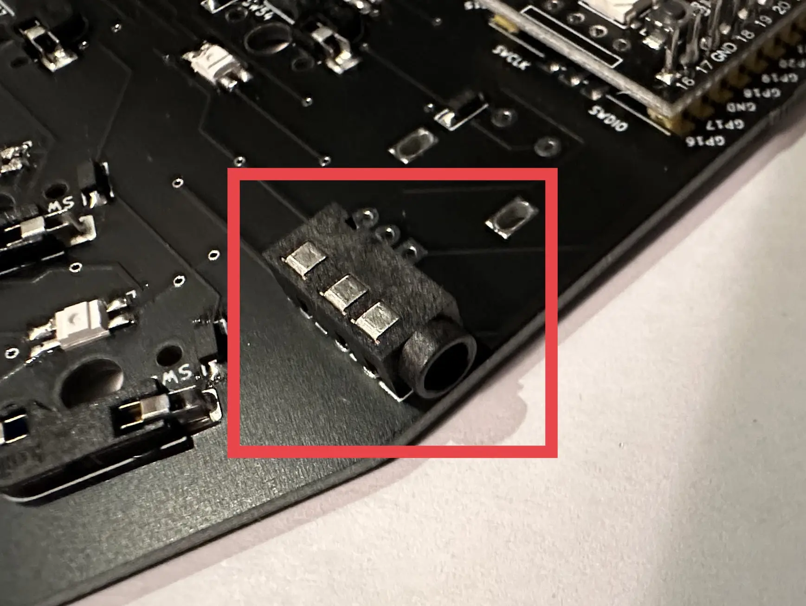

Front-side PCB:

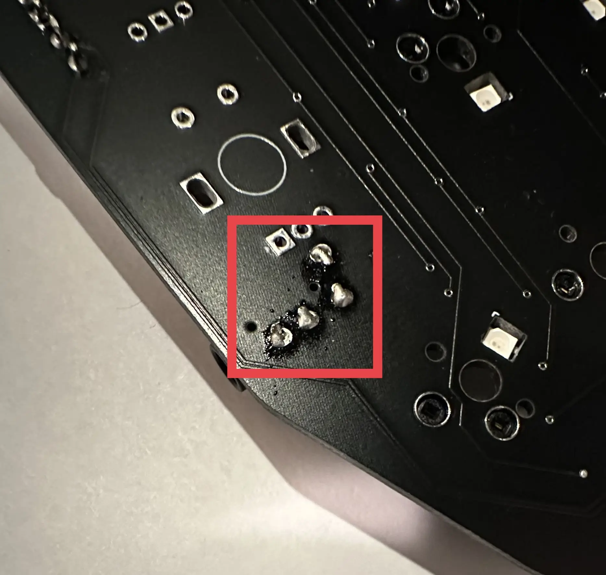

On the **front-side** of the PCB, place the rotary encoder(s). On the backside of the PCB, bend the pins of the encoder to "latch" onto the PCB and solder.

Front-side PCB:

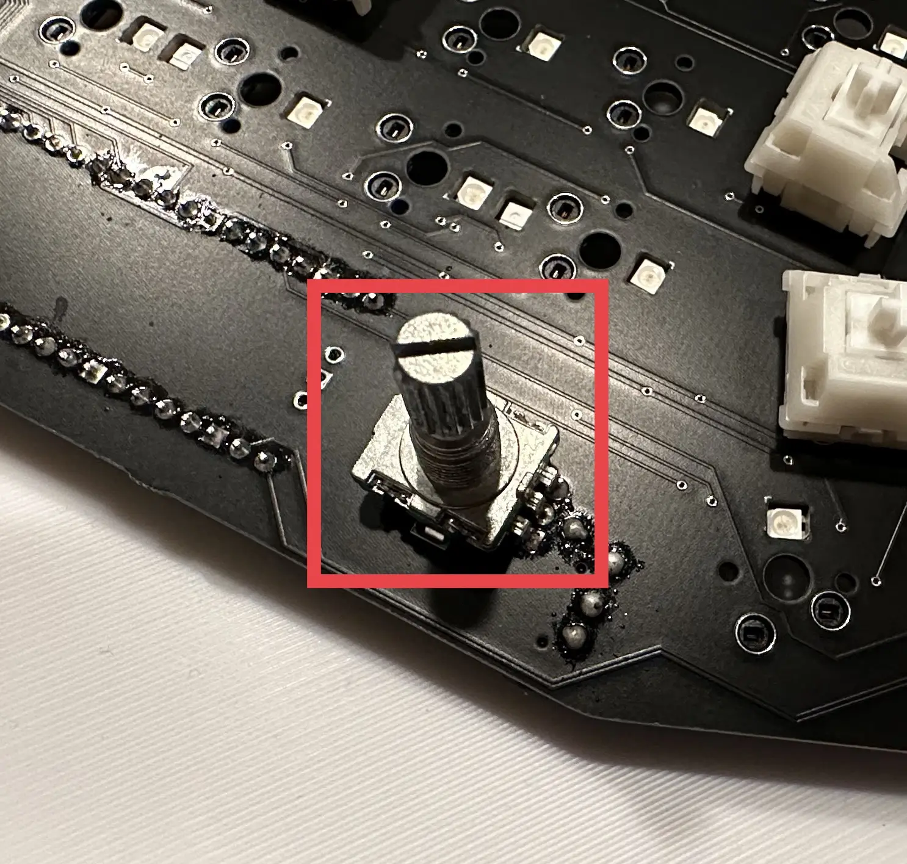

Backside PCB:

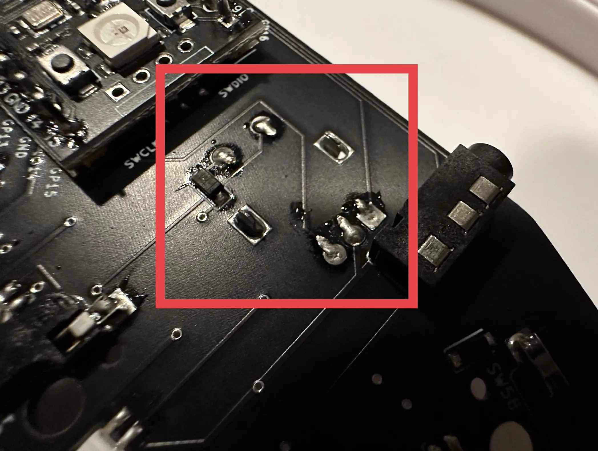

### Case

At the moment, the case files included in the [case directory](./Case) support 3D printing of a case assuming PCB mounted switches (since the 3mm switch plate is resting on the PCB). Since I do not own or have easy access to a 3D printer, the case was designed to be easy to print with 3rd party printing services in-mind such as Treatstock.

Raw files are provided for designing your own case if you see fit. Further work on the case may occur in the future to properly suspend the switch plate. PRs are welcome.

The case is comprised of 4 parts, 8 M3 screws, and 8 M3 nuts.

To have a functional case you need the Bottom Left and Bottom Right along with a Left Switch Plate and a Right Switch Plate. 4 M3 screws and their nuts will hold the switch plate and bottom together for each side of the split. Recommend printing the bottom in white at 40% infill so the underglow LEDs can bleed through.

The naming schemes "- 2 Rotary" and "- 4 Rotary" are products of the raw files used to model the case.

The switch plates named "- 2 Rotary" assume 1 rotary encoder will be used on that side of the split. One by they thumb keys.

The switch plates named "- 4 Rotary" assume 2 rotary encoders will be used on that side of the split. One by the thumb keys and one in the far bottom corner

If you would like to have 3 rotary encoders rather than 2 total or 4 total you would use both variants. The side that will have 2 rotary encoders will use the "- 4 Rotary", while the other side with 1 rotary encoder will use the "- 2 Rotary".

As mentioned in [design quirks](#quirks), there are some problems with making the switch plate flush with the PCB. After you get it flush, you can completely assemble your keyboard! Assembly goes in the reverse of the following:

-- Keycaps --

-- Switches --

-- Case Switch Plate -- (screw + nut connect the plate with the bottom)

-- PCB --

-- Case Bottom --

### Flashing the firmware

Junco is powered by the QMK firmware, see the [build environment setup](https://docs.qmk.fm/#/getting_started_build_tools). Brand new to QMK? Start with the [Complete Newbs Guide](https://docs.qmk.fm/#/newbs).

Flashing instructions can be found [here](https://github.com/qmk/qmk_firmware/tree/master/keyboards/junco).

Congratulations and enjoy your split keyboard!

## Troubleshooting

### No LEDs are working

Try the following until problem solved:

1. Ensure the level shifter is properly soldered onto the PCB, re-solder as needed.
2. There is a diode without a corresponding switch located to the top right of the Pico on both sides of the split, check and re-solder that diode as needed.
    1. Short the pads on either side of the diode on both halves.
       1. If some the LEDs turn on, re-solder the diodes. Replace it if problem persists.
       2. If no LEDs turn on after shorting the diode's pads, there is likely a problem with the first LED, move to the next section for the first LED in the electrical order. If that still doesn't work, the level shifter is likely damaged and needs to be replaced.

### Some LEDs are not working

Go through the LED electrical order (pictured below) until you reach the problem LED. That LED **or** the one previous to it has a problem.

LED Electrical Order (1-8 are underglow):

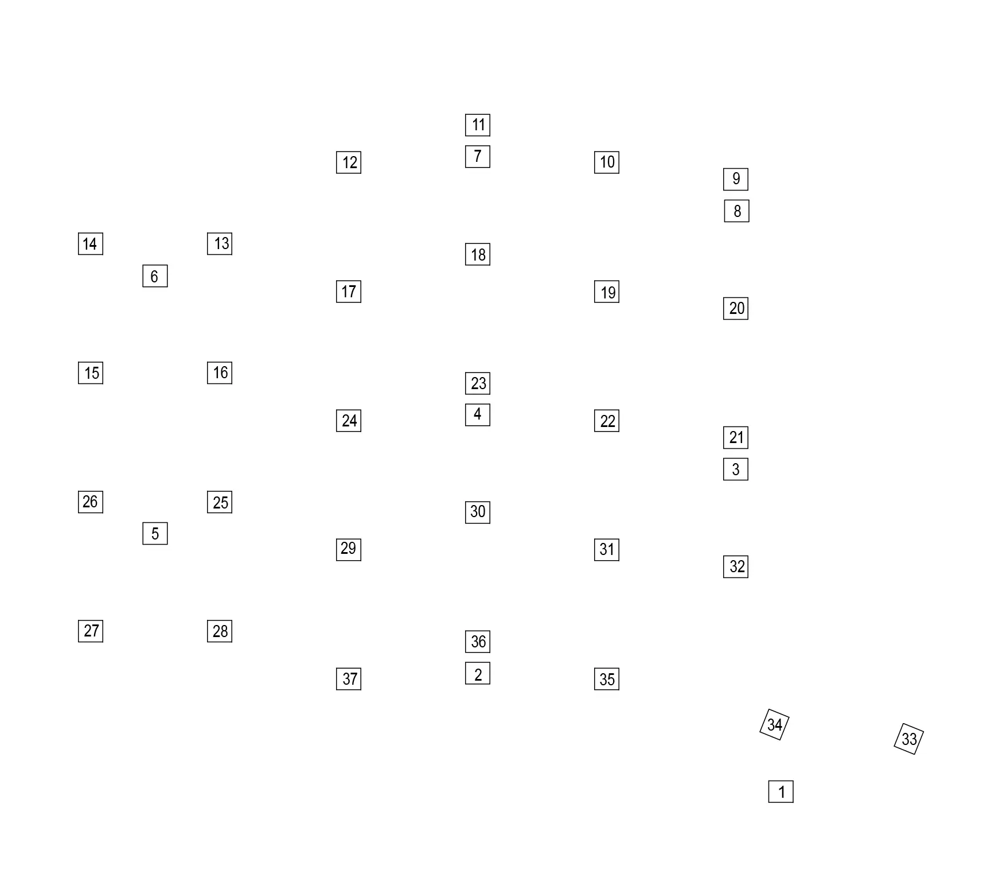

Right side is identical but mirrored.

Try the following until problem solved:

1. Check that the pads of LED not turning on and its previous are soldered correctly, re-solder for a better connection as needed.
2. Double check that the LED not turning on is in the correct orientation.
3. If the soldering looks good and the orientation is correct, try re-soldering all the pads any way for good measure.
4. If re-soldering didn't work than the LED is likely dead or damaged in which case replace it.

### An entire row or column of keys is not working

In this case, there is most likely a problem with the PCB's connection to the Pico. Note that the bottom row of keys is staggered by 2, so the the corresponding matrix column is shifted.

Rows:

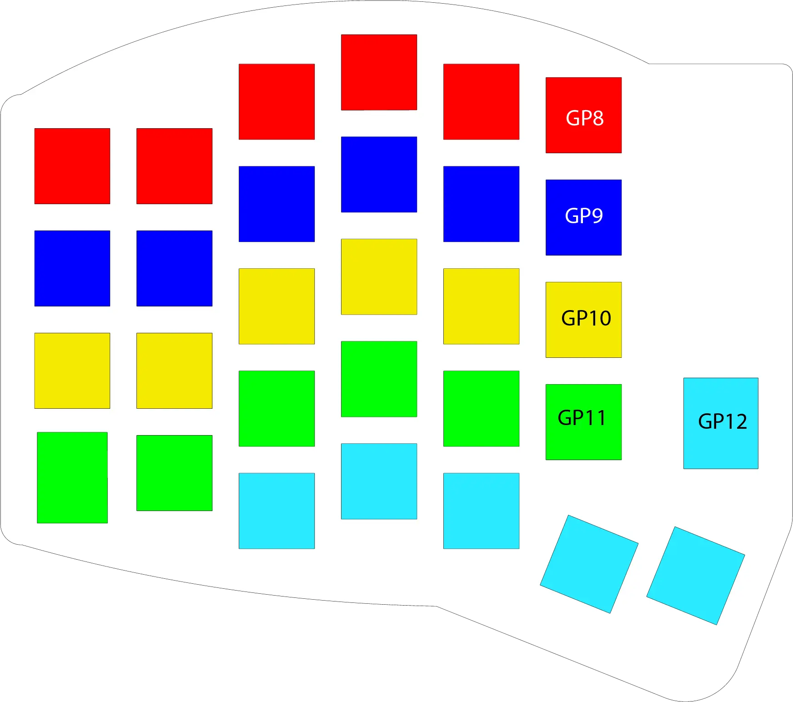

Cols:

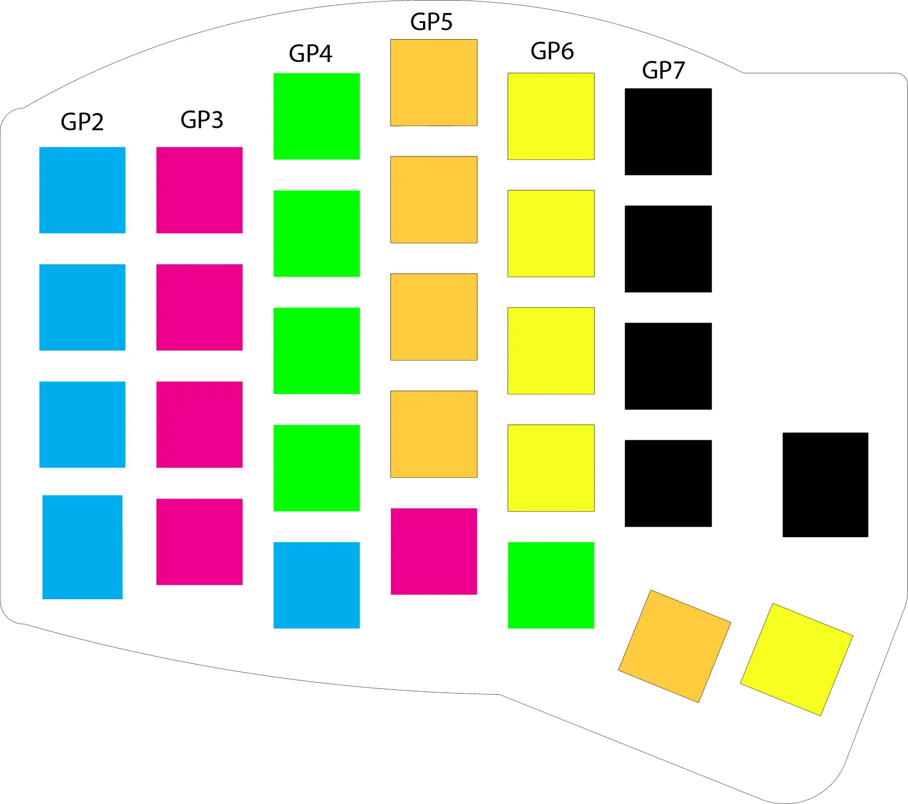

The right side is identical but mirrored.

Try the following until problem solved:

1. Double check that you have soldered the Pico into the correct holes.
2. Ensure the soldering connections of the Pico to the PCB is good (if you used a header to solder the Pico onto the PCB one of the connections to the through-hole is likely bad). Re-solder as needed.
3. If none of the connections are obviously bad, use the image above to see what row/column corresponds to what connection (GP numbering on back of PCB). Re-solder that specific connection for good measure and test.
4. If re-soldering the connection didn't work, your Pico or PCB is likely damaged. Rule out the Pico by directly shorting the that row or column's corresponding pad on the Pico with another column/row pad (connecting one row and one column). If a key press is registered, there is a problem with your PCB, see the bottom of the next section about potentially fixing paths on the PCB. If no keypress is registered, the Pico is damaged and have fun de-soldering your Pico (hot-air station or careful work with a heat gun is the best way).

### Random key or keys not working

Note that the bottom row of keys is staggered by 2, so the the corresponding matrix column is shifted. See the photo in the above section.

If it's not a row or column of keys, than there is a bad connection between your switch and PCB.

Try the following until problem solved:

1. Re-seat the switch in the hot-swap socket.
2. Try a different switch.
3. Check the soldering of the hot-swap socket to the PCB, re-solder as needed
4. Short the PCB pads on either side of the hot-swap socket, if that registers a keypress, the hot-swap socket is bad and needs to replaced.
5. Check the diode.
   1. Check the soldering of the diode to the PCB and re-solder as needed.
   2. Double check that the diode is oriented correctly.
   3. Make sure diode actually works and has a good connection.
      1. Read the diode with a multimeter, typically reads a little more than 0.6. Higher numbers usually means the solder connection is bad, de-solder and re-solder the diode. If not reading, diode is bad and needs to be replaced.
      2. No multimeter? Short either side of the diode and press the key. If that works either the diode's connection is bad and re-solder, or the diode is dead and needs to be replaced.
6. If none of the above worked, the problem is most likely with the paths inside the PCB.
   1. You can try the following: (credit to [crkbd](https://github.com/foostan/crkbd) guide)
      1. "Visually inspect the PCB. If it looks scratched or damaged anywhere along the path from ProMicro to diode to keyswitch, the path might be interrupted. If you find a spot that looks damaged, you can use some wire to bypass the section that is damaged (e.g. connecting the ProMicro directly to the first pad of the diode). If this fixes the key, then you can either opt to keep the wire permanently, or you can try to repair the path. The path can be repaired by carefully scraping off the paint from a section of the path that is okay on either side of the damaged part (use a small flat head screwdriver intended for electronics). Then clean carefully with alcohol and solder a new connection. Youtube might have some guides on how to do this."
